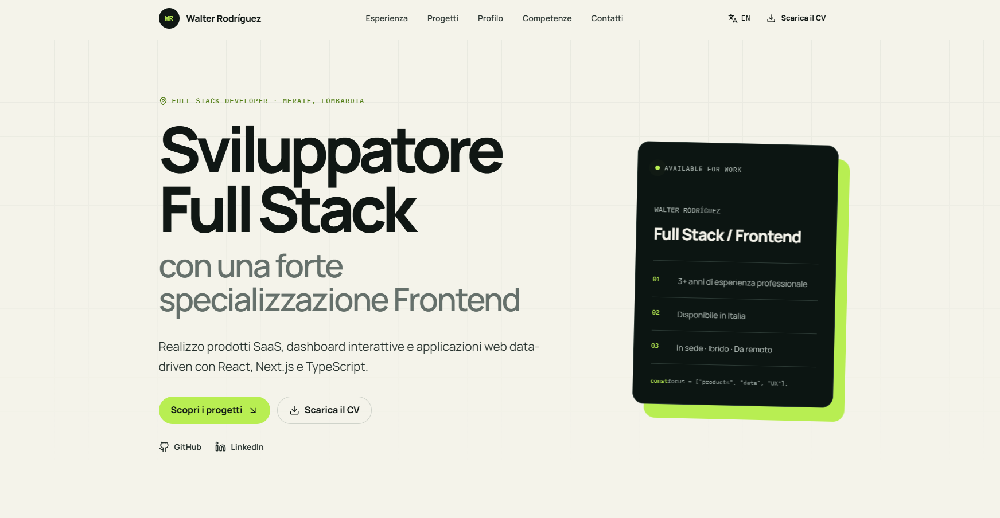

# Walter Rodríguez — Developer Portfolio

Professional portfolio built to present my experience, selected projects, and
technical background as a Full Stack Developer with a strong Frontend
specialization.

<p align="center">
  <a href="https://marvin1604-portafolio.netlify.app/it">Italian Version</a>
  ·
  <a href="https://marvin1604-portafolio.netlify.app/en">English Version</a>
  ·
  <a href="https://github.com/marvin1604">GitHub Profile</a>
</p>

<p align="center">
  
</p>

## Overview

This portfolio reflects my current professional experience and technical
profile. It highlights my work on frontend architecture, SaaS products,
interactive dashboards, reusable components, and data-driven web applications.

The website is available in Italian and English and is designed for
opportunities in Italy and with international teams.

## Main features

- Italian and English versions
- Responsive layout for desktop, tablet, and mobile
- Professional experience and featured projects
- Downloadable Italian CV
- Contact form powered by Formspree
- Localized metadata, canonical URLs, and language alternates
- Open Graph and Twitter metadata
- Generated `robots.txt` and sitemap
- Accessible navigation and semantic HTML
- Reusable, typed content architecture
- Subtle scroll, hover, and pointer interactions with reduced-motion support

## Tech stack

- **Framework:** Next.js 16 with App Router
- **Frontend:** React 19 and TypeScript
- **Styling:** Tailwind CSS 4
- **Icons:** Lucide React
- **Forms:** Formspree
- **Deployment:** Netlify with the Next.js plugin
- **Content:** Localized Italian and English data
- **SEO:** Next.js Metadata API, robots, sitemap, and Open Graph images

## Project structure

```text
src/
├── app/          # Routes, metadata, SEO files, and global styles
├── components/   # Shared UI, layout, and motion components
├── data/         # Italian and English portfolio content
├── sections/     # Main portfolio sections
└── types/        # TypeScript content types

public/
├── cv/           # Downloadable CV
└── images/       # Project imagery
```

## Run locally

```bash
git clone https://github.com/marvin1604/portafolio-react.git
cd portafolio-react
npm install
npm run dev
```

Open [http://localhost:3000](http://localhost:3000). The root route redirects
to the Italian version.

Useful checks:

```bash
npm run lint
npm run build
```

## Deployment

The website is deployed on Netlify:

- [Italian version](https://marvin1604-portafolio.netlify.app/it)
- [English version](https://marvin1604-portafolio.netlify.app/en)

Set the production site URL so canonical URLs, robots, sitemap, and Open Graph
metadata use the correct origin:

```env
NEXT_PUBLIC_SITE_URL=https://marvin1604-portafolio.netlify.app
```

The Netlify build uses Node.js 22, publishes the Next.js output, and runs the
official Netlify Next.js plugin.

## Author

**Walter Rodríguez**

- [Portfolio](https://marvin1604-portafolio.netlify.app/it)
- [LinkedIn](https://www.linkedin.com/in/walter-rodriguez-sanchez/)
- [GitHub](https://github.com/marvin1604)
- [Email](mailto:walter.rodriguez.dev@gmail.com)
